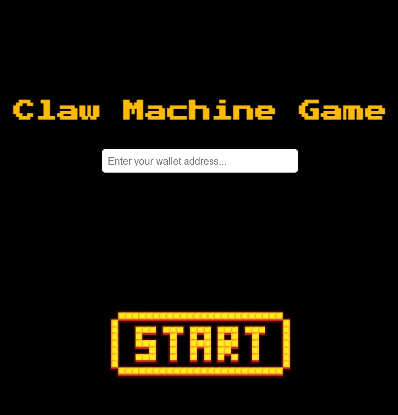
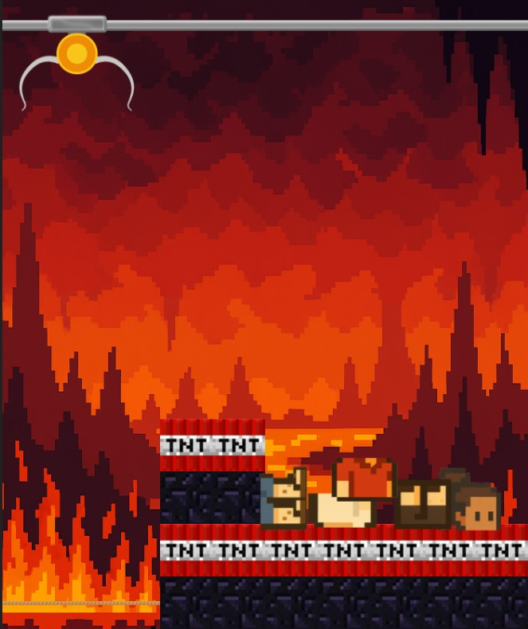

# Crane Game NFT: Play, Assemble, and Mint!

Welcome to the Crane Game NFT project! This is a fun, interactive web game where your in-game achievements become real assets on the blockchain. Play the classic crane game to catch different doll parts, and once you collect a full set (head, body, and feet), you can assemble them into a unique NFT that gets minted directly to your wallet.

This project is built with **Phaser** for the game engine and **Hardhat** for smart contract management on the **Polygon Amoy testnet**.

---
### 🎥 Demo Video

Click the image below to watch a video demonstration of the game and the entire NFT minting process.

[](https://youtu.be/D91scOxYt7g)

### Screenshots




---

## How to Get Started(local)

Follow these steps to get the project running on your local machine.

### Step 1: Clone the Project

First, clone this repository to your computer using Git.

```bash
git clone <https://github.com/HexPang/Crane-Machine-Game.git>
```

### Step 2: Configure Environment Variables

You need to set up your environment variables to connect to the blockchain and other services. Start by copying the example file:

```bash
cp .env.example .env
```

Now, open the `.env` file and fill in the following values.

### Step 3: Understanding the Environment Variables

Here's what each variable in the `.env` file does:

-   `PRIVATE_KEY`: **(Required & Secret)** Your wallet's private key. This is needed to deploy the contract and pay for transactions. **Never share this or commit it to a public repository!**
-   `AMOY_RPC_URL`: **(Required)** The URL for connecting to the Polygon Amoy testnet. A default public one is provided.
-   `PINATA_API_KEY` & `PINATA_SECRET_API_KEY`: **(Required)** Your API keys from [Pinata.cloud](https://app.pinata.cloud/). Pinata is used to store your NFT images and metadata on the decentralized IPFS network.
-   `CONTRACT_ADDRESS`: Leave this empty for now. You'll fill this in after you deploy the smart contract in the next step.
-   `RECIPIENT_ADDRESS`: Your public wallet address (e.g., `0x...`). This is where your minted NFTs will be sent.
-   `USE_IPFS`: **(Optional)** A flag to control uploads to IPFS. Set to `true` to automatically upload NFT media to the decentralized IPFS network via Pinata.
-   `MUMBAI_RPC_URL`: **(Optional)** The RPC URL for the Polygon Mumbai testnet. This is for legacy support, as the project now primarily uses the **Amoy** testnet. You can leave this blank.

### Step 4: Get Test Tokens (Amoy Testnet)

### Polygon Amoy Testnet
To deploy contracts and make transactions on a blockchain, you need cryptocurrency to pay for "gas" fees. On a testnet, this currency is free.

- **Network Name:** Polygon Amoy Testnet
- **RPC URL:** https://rpc-amoy.polygon.technology
- **Chain ID:** 80002
- **Currency Symbol:** MATIC
- **Block Explorer:** https://www.oklink.com/amoy
This project uses the **Polygon Amoy** testnet. You can get free test MATIC from a public faucet:
-   **Go to [Polygon Faucet](https://faucet.polygon.technology/)**
-   Select the **Amoy** network, enter your wallet address, and receive your test tokens.

### Step 5: Deploy the NFT Smart Contract

The core of the NFT functionality lies in the `contracts/GameNFT.sol` smart contract. This is an **ERC-721 contract** responsible for creating (minting), tracking, and transferring the unique ownership of each doll NFT.

1.  **Run the deployment script**:
    Execute the following command in your terminal. This will compile the contract and deploy it to the Amoy testnet.
    ```bash
    npx hardhat run scripts/deploy.js --network amoy
    ```

2.  **Update your `.env` file**:
    After the script finishes, it will print the newly deployed **contract address**. Copy this address and paste it into the `CONTRACT_ADDRESS` field in your `.env` file.

### Step 6: Start the Game!

Now you're ready to play. Run the local web server with this command:

```bash
node server.js
```

The game will be running at `http://localhost:3001`. Open this URL in your browser.


---

## Gameplay: From Parts to NFT

Here's how to earn your first NFT:

1.  **Enter Your Wallet Address**: When the game loads, it will prompt you for your public wallet address. This ensures the NFT is sent to you.
2.  **Catch the Three Parts**: Play the game and skillfully maneuver the crane to catch one of each of the three doll parts: a **head**, a **body**, and **feet**.
3.  **NFT Assembled and Minted!**: Once you have collected a full set, the game will automatically assemble the parts into a complete doll, upload it to IPFS, and mint it as a brand new NFT. It will then be transferred to the wallet address you provided at the start. Congratulations on your new NFT!


### Contact Us

- **Melita**: [manchien1105@gmail.com](mailto:manchien1105@gmail.com)
- **Julia**: [yunnn0028@gmail.com](mailto:yunnn0028@gmail.com)
- **Sally**: [warmrnlin@gmail.com](mailto:warmrnlin@gmail.com)
